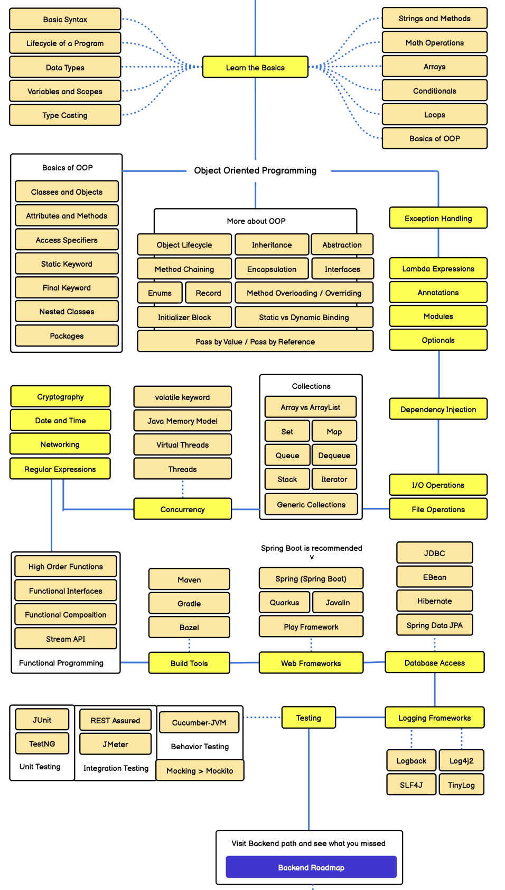

# Java Developer Roadmap

Roadmap này được dựng theo ảnh `java.png` bạn đưa. Mục tiêu là học đúng trình tự, từ Java core đến OOP, collections, concurrency, functional programming, build tools, web framework, database, testing và logging.

> Mốc phiên bản: nên học với JDK 25 LTS nếu máy bạn cài được. Java 21 LTS vẫn rất ổn cho Spring Boot và đa số dự án. Java 26 là bản non-LTS phát hành ngày 2026-03-17, còn Java 25 LTS phát hành ngày 2025-09-16.

## Cách học

1. Đi từ trái sang phải trong từng nhóm.
2. Mỗi ô dưới đây là một link tới file Markdown riêng.
3. Với mỗi bài, hãy đọc lý thuyết, gõ lại code, tự sửa biến/tình huống, rồi làm bài tập cuối file.
4. Sau khi học xong `Build Tools`, hãy tạo một project Maven hoặc Gradle nhỏ để gom code luyện tập.
5. Sau `Spring Boot`, hãy làm một CRUD API sinh viên/môn học có database và test.

## Roadmap Clickable

### 1. Learn the Basics

| Trái | Trung tâm | Phải |
|---|---|---|
| [Basic Syntax](java/basic-syntax.md) | **Learn the Basics** | [Strings and Methods](java/strings-and-methods.md) |
| [Lifecycle of a Program](java/lifecycle-of-a-program.md) |  | [Math Operations](java/math-operations.md) |
| [Data Types](java/data-types.md) |  | [Arrays](java/arrays.md) |
| [Variables and Scopes](java/variables-and-scopes.md) |  | [Conditionals](java/conditionals.md) |
| [Type Casting](java/type-casting.md) |  | [Loops](java/loops.md) |
|  |  | [Basics of OOP](java/basics-of-oop.md) |

### 2. Object Oriented Programming

| Basics of OOP | More about OOP | Modern/Advanced OOP |
|---|---|---|
| [Classes and Objects](java/classes-and-objects.md) | [Object Lifecycle](java/object-lifecycle.md) | [Abstraction](java/abstraction.md) |
| [Attributes and Methods](java/attributes-and-methods.md) | [Method Chaining](java/method-chaining.md) | [Interfaces](java/interfaces.md) |
| [Access Specifiers](java/access-specifiers.md) | [Enums](java/enums.md) | [Method Overloading / Overriding](java/method-overloading-overriding.md) |
| [Static Keyword](java/static-keyword.md) | [Initializer Block](java/initializer-block.md) | [Static vs Dynamic Binding](java/static-vs-dynamic-binding.md) |
| [Final Keyword](java/final-keyword.md) | [Inheritance](java/inheritance.md) | [Pass by Value / Pass by Reference](java/pass-by-value-pass-by-reference.md) |
| [Nested Classes](java/nested-classes.md) | [Encapsulation](java/encapsulation.md) |  |
| [Packages](java/packages.md) | [Record](java/record.md) |  |

### 3. Core Java nâng cao

| Chủ đề |
|---|
| [Exception Handling](java/exception-handling.md) |
| [Lambda Expressions](java/lambda-expressions.md) |
| [Annotations](java/annotations.md) |
| [Modules](java/modules.md) |
| [Optionals](java/optionals.md) |
| [Dependency Injection](java/dependency-injection.md) |
| [I/O Operations](java/io-operations.md) |
| [File Operations](java/file-operations.md) |
| [Cryptography](java/cryptography.md) |
| [Date and Time](java/date-and-time.md) |
| [Networking](java/networking.md) |
| [Regular Expressions](java/regular-expressions.md) |

### 4. Functional Programming

| Functional Programming |
|---|
| [High Order Functions](java/high-order-functions.md) |
| [Functional Interfaces](java/functional-interfaces.md) |
| [Functional Composition](java/functional-composition.md) |
| [Stream API](java/stream-api.md) |

### 5. Concurrency

| Concurrency |
|---|
| [volatile keyword](java/volatile-keyword.md) |
| [Java Memory Model](java/java-memory-model.md) |
| [Virtual Threads](java/virtual-threads.md) |
| [Threads](java/threads.md) |

### 6. Collections

| Collections |
|---|
| [Array vs ArrayList](java/array-vs-arraylist.md) |
| [Set](java/set.md) |
| [Map](java/map.md) |
| [Queue](java/queue.md) |
| [Deque](java/deque.md) |
| [Stack](java/stack.md) |
| [Iterator](java/iterator.md) |
| [Generic Collections](java/generic-collections.md) |

### 7. Build Tools

| Build Tools |
|---|
| [Maven](java/maven.md) |
| [Gradle](java/gradle.md) |
| [Bazel](java/bazel.md) |

### 8. Web Frameworks

Spring Boot được khuyến nghị học trước nếu mục tiêu của bạn là backend Java phổ thông.

| Web Frameworks |
|---|
| [Spring (Spring Boot)](java/spring-spring-boot.md) |
| [Quarkus](java/quarkus.md) |
| [Javalin](java/javalin.md) |
| [Play Framework](java/play-framework.md) |

### 9. Database Access

| Database Access |
|---|
| [JDBC](java/jdbc.md) |
| [EBean](java/ebean.md) |
| [Hibernate](java/hibernate.md) |
| [Spring Data JPA](java/spring-data-jpa.md) |

### 10. Testing

| Unit | Integration | Behavior |
|---|---|---|
| [JUnit](java/junit.md) | [REST Assured](java/rest-assured.md) | [Cucumber-JVM](java/cucumber-jvm.md) |
| [TestNG](java/testng.md) | [JMeter](java/jmeter.md) | [Mocking > Mockito](java/mocking-mockito.md) |
| [Unit Testing](java/unit-testing.md) | [Integration Testing](java/integration-testing.md) | [Behavior Testing](java/behavior-testing.md) |

### 11. Logging Frameworks

| Logging Frameworks |
|---|
| [Logback](java/logback.md) |
| [Log4j2](java/log4j2.md) |
| [SLF4J](java/slf4j.md) |
| [TinyLog](java/tinylog.md) |

## Project luyện tập sau roadmap

Làm một app `Student Course Management`:

- Java core: class `Student`, `Course`, `Enrollment`.
- Collections: lưu danh sách sinh viên, tìm kiếm bằng `Map`.
- File I/O: import/export CSV.
- JDBC/JPA: lưu vào PostgreSQL hoặc H2.
- Spring Boot: REST API CRUD.
- Testing: JUnit unit test, Spring integration test, REST Assured API test.
- Logging: SLF4J + Logback.

## Nguồn facts phiên bản Java

- OpenJDK JDK 25: https://openjdk.org/projects/jdk/25/
- Oracle Java SE Support Roadmap: https://www.oracle.com/java/technologies/java-se-support-roadmap.html
- JDK 26 Release Notes: https://jdk.java.net/26/release-notes
