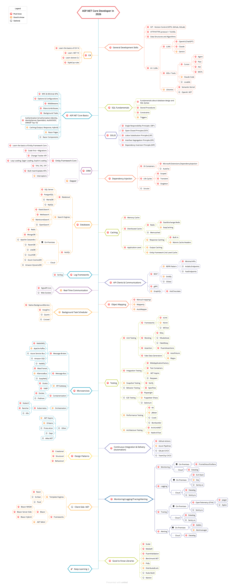

# ASP.NET Core Developer in 2026

Folder này bám theo ảnh `aspnetcore-developer-roadmap.png`. Nó tách riêng với các roadmap Java, tập trung vào C#, .NET 10, ASP.NET Core, EF Core, database, caching, testing, microservices, CI/CD và observability.

## Mốc version nên học

- Học chính: **.NET 10 LTS** và **C# 14**.
- .NET 10 LTS là bản LTS hiện tại trong roadmap 2026.
- .NET 9 STS và .NET 8 LTS vẫn còn supported trong năm 2026 nhưng đều hết support vào tháng 11/2026 theo lifecycle chính thức.
- Khi làm project thật, kiểm tra bằng `dotnet --info` và file `.csproj`.

## Cách dùng roadmap này

1. Học **C# and .NET Prerequisites** trước.
2. Học tiếp **General Development Skills**, **SQL Fundamentals**, **SOLID**, **Dependency Injection**.
3. Vào trọng tâm: **ASP.NET Core Basics**, **EF Core**, **Databases**, **Testing**, **Observability**.
4. Sau đó chọn nhánh nâng cao: caching, messaging, microservices, client-side .NET, AI/LLM.
5. Mỗi topic có file riêng, đọc xong phải tự gõ code và viết test nhỏ.

## Thống kê

- Tổng số bài: **225**
- Must know: **127**
- Good to know: **61**
- Optional: **37**

## Lộ trình gợi ý cho sinh viên

### Giai đoạn 1: Nền tảng

- C# 14, .NET 10, dotnet CLI.
- Git, HTTP/HTTPS, SQL, DSA.
- SOLID và Dependency Injection.

### Giai đoạn 2: ASP.NET Core thực chiến

- Minimal APIs hoặc MVC Controller.
- Options/configuration, middleware, filters, authentication/authorization.
- EF Core, migrations, PostgreSQL hoặc SQL Server.
- Serilog, OpenAPI/Scalar, validation.

### Giai đoạn 3: Testing và production

- Unit test: xUnit, FluentAssertions, Moq/NSubstitute.
- Integration test: WebApplicationFactory, Testcontainers, Respawn.
- Observability: OpenTelemetry, logs, traces, metrics, alerts.
- CI/CD: GitHub Actions hoặc Azure Pipelines.

### Giai đoạn 4: Distributed systems

- Caching: memory cache, Redis, output cache.
- Messaging: RabbitMQ/MassTransit hoặc Kafka.
- API gateway: YARP/Ocelot.
- Containerization: Docker, Kubernetes basics.

## Roadmap Clickable

### C# and .NET Prerequisites

| Chủ đề | Mức | Học để làm gì |
|---|---|---|
| [C#](topics/c-sharp.md) | Must know | Ngôn ngữ chính để viết ASP.NET Core: type system, OOP, LINQ, async/await, pattern matching, nullable reference types. |
| [Learn the basics of C# 14](topics/learn-the-basics-of-c-sharp-14.md) | Must know | Nắm cú pháp C# hiện đại theo .NET 10, nhưng vẫn hiểu codebase cũ dùng C# 10/11/12/13. |
| [Learn .NET 10](topics/learn-dotnet-10.md) | Must know | .NET 10 LTS là mốc học chính cho 2026: runtime, SDK, project system, hosting, configuration, DI, logging. |
| [Learn dotnet CLI](topics/learn-dotnet-cli.md) | Must know | Dùng terminal để tạo project, restore, build, test, publish và quản lý tool/template. |
| [StyleCop rules](topics/stylecop-rules.md) | Must know | Quy tắc style/analyzer giúp code C# đồng nhất và bắt lỗi sớm ngay lúc build. |

### General Development Skills

| Chủ đề | Mức | Học để làm gì |
|---|---|---|
| [General Development Skills](topics/general-development-skills.md) | Must know | Kỹ năng nền không phụ thuộc framework: Git, HTTP, thuật toán, AI tools và tư duy phát triển phần mềm. |
| [GIT - Version Control](topics/git-version-control.md) | Must know | Version control với Git, GitHub/GitLab: commit, branch, merge, rebase, pull request và conflict. |
| [HTTP/HTTPS protocol + TLS/SSL](topics/http-https-protocol-tls-ssl.md) | Must know | Nền tảng web API: method, header, status code, JSON, cache, TLS và bảo mật truyền tải. |
| [Data Structures and Algorithms](topics/data-structures-and-algorithms.md) | Must know | Biết chọn cấu trúc dữ liệu và phân tích độ phức tạp để API không chậm khi dữ liệu tăng. |
| [AI / LLMs](topics/ai-llms.md) | Must know | Biết dùng AI/LLM trong workflow dev và trong sản phẩm: prompt, RAG, tools, guardrails, privacy. |
| [OpenAI ChatGPT](topics/openai-chatgpt.md) | Must know | Dùng ChatGPT/OpenAI cho học tập, coding, tài liệu, test case và tích hợp API khi cần. |
| [Claude](topics/claude.md) | Good to know | Một LLM phổ biến để đọc code, giải thích kiến trúc và hỗ trợ viết tài liệu. |
| [Gemini](topics/gemini.md) | Good to know | LLM của Google, nên biết để so sánh workflow và hệ sinh thái. |
| [IDEs / Tools](topics/ides-tools.md) | Must know | Biết chọn IDE/editor, debugger, profiler, AI coding tools và terminal workflow. |
| [Cursor](topics/cursor.md) | Good to know | AI-first editor hỗ trợ agentic coding, hỏi đáp codebase và chỉnh sửa nhiều file. |
| [Cursor Agent](topics/cursor-agent.md) | Good to know | Chế độ agent để giao việc code có nhiều bước, cần kiểm tra diff và test kỹ. |
| [Cursor Plan](topics/cursor-plan.md) | Good to know | Chế độ lập kế hoạch trước khi sửa code, hữu ích cho thay đổi lớn. |
| [Cursor Ask](topics/cursor-ask.md) | Good to know | Chế độ hỏi đáp codebase mà chưa sửa file. |
| [MCPs](topics/mcps.md) | Good to know | Model Context Protocol giúp AI tool kết nối nguồn dữ liệu/công cụ ngoài. |
| [Claude Code](topics/claude-code.md) | Good to know | CLI/agent coding workflow, cần review code và test như mọi tool AI khác. |
| [Lovable](topics/lovable.md) | Optional | AI app builder, biết để tạo prototype nhanh nhưng không thay thế hiểu biết backend. |
| [AI Libraries](topics/ai-libraries.md) | Good to know | Thư viện .NET để tích hợp LLM, embedding, orchestration, memory và tools. |
| [Semantic Kernel](topics/semantic-kernel.md) | Good to know | Framework của Microsoft cho AI orchestration, planner, plugins, memory và connectors. |
| [OpenAI .NET](topics/openai-dotnet.md) | Good to know | SDK .NET để gọi OpenAI API trong ứng dụng C#. |

### SQL Fundamentals

| Chủ đề | Mức | Học để làm gì |
|---|---|---|
| [SQL Fundamentals](topics/sql-fundamentals.md) | Must know | Nền tảng database quan hệ: schema, query, index, transaction, constraints, stored procedures. |
| [Database Design and SQL Syntax](topics/database-design-and-sql-syntax.md) | Must know | Thiết kế bảng, khóa chính/khóa ngoại, chuẩn hóa vừa đủ, SELECT/INSERT/UPDATE/DELETE/JOIN. |
| [Stored Procedures](topics/stored-procedures.md) | Must know | Logic SQL đóng gói trong database, cần biết ưu/nhược khi dùng cùng ORM/API. |
| [Constraints](topics/constraints.md) | Must know | Ràng buộc dữ liệu như NOT NULL, UNIQUE, CHECK, FOREIGN KEY để bảo vệ dữ liệu ở DB. |
| [Triggers](topics/triggers.md) | Must know | Logic tự chạy khi INSERT/UPDATE/DELETE, mạnh nhưng dễ ẩn side effect nếu lạm dụng. |

### SOLID

| Chủ đề | Mức | Học để làm gì |
|---|---|---|
| [SOLID](topics/solid.md) | Must know | Năm nguyên tắc thiết kế OOP giúp service/controller/domain dễ thay đổi và test. |
| [Single Responsibility Principle (SRP)](topics/single-responsibility-principle-srp.md) | Must know | Một class/module nên có một lý do chính để thay đổi. |
| [Open-Closed Principle (OCP)](topics/open-closed-principle-ocp.md) | Must know | Mở rộng hành vi bằng abstraction/composition thay vì sửa code cũ liên tục. |
| [Liskov Substitution Principle (LSP)](topics/liskov-substitution-principle-lsp.md) | Must know | Subtype phải thay thế được base type mà không phá contract. |
| [Interface Segregation Principle (ISP)](topics/interface-segregation-principle-isp.md) | Must know | Interface nên nhỏ và theo nhu cầu client, tránh ép class implement thứ không dùng. |
| [Dependency Inversion Principle (DIP)](topics/dependency-inversion-principle-dip.md) | Must know | High-level module phụ thuộc abstraction, không phụ thuộc trực tiếp low-level implementation. |

### Dependency Injection

| Chủ đề | Mức | Học để làm gì |
|---|---|---|
| [Dependency Injection](topics/dependency-injection.md) | Must know | Kỹ thuật đưa dependency từ ngoài vào, nền tảng của ASP.NET Core service container. |
| [DI Containers](topics/di-containers.md) | Must know | Container quản lý lifetime và resolve dependency graph. |
| [Microsoft.Extensions.DependencyInjection](topics/microsoft-extensions-dependencyinjection.md) | Must know | DI container mặc định trong ASP.NET Core, đủ cho đa số ứng dụng. |
| [AutoFac](topics/autofac.md) | Good to know | DI container mạnh hơn với module, convention scanning và advanced registration. |
| [Life Cycles](topics/life-cycles.md) | Must know | Service lifetime quyết định object sống bao lâu: singleton, scoped, transient. |
| [Scoped](topics/scoped.md) | Must know | Một instance cho mỗi scope/request, rất thường dùng cho DbContext/service request-bound. |
| [Transient](topics/transient.md) | Must know | Tạo instance mới mỗi lần resolve, phù hợp service nhẹ không giữ state. |
| [Singleton](topics/singleton.md) | Must know | Một instance cho toàn app, phải thread-safe và không phụ thuộc scoped service trực tiếp. |
| [Scrutor](topics/scrutor.md) | Optional | Thư viện scanning/registration/decorator cho Microsoft DI. |

### ASP.NET Core Basics

| Chủ đề | Mức | Học để làm gì |
|---|---|---|
| [ASP.NET Core Basics](topics/asp-net-core-basics.md) | Must know | Các building blocks của ASP.NET Core: hosting, middleware, endpoint, controller, config, auth, caching. |
| [MVC & Minimal APIs](topics/mvc-minimal-apis.md) | Must know | Hai cách xây HTTP API phổ biến: MVC Controller đầy đủ và Minimal API gọn nhẹ. |
| [Options & Configurations](topics/options-configurations.md) | Must know | Configuration từ appsettings, environment, secrets; Options pattern để bind config type-safe. |
| [Middlewares](topics/middlewares.md) | Must know | Pipeline xử lý request/response trong ASP.NET Core. |
| [Filters & Attributes](topics/filters-attributes.md) | Must know | Cơ chế chạy logic quanh action/controller: auth, validation, exception, logging. |
| [Background Tasks](topics/background-tasks.md) | Must know | Chạy tác vụ nền bằng hosted service, worker service hoặc scheduler. |
| [Authentication & Authorization](topics/authentication-authorization.md) | Must know | Xác thực user/service và phân quyền theo role/claim/policy. |
| [IdentityServer / OpenIddict / Auth0 / OIDC / OWASP Top 10](topics/identityserver-openiddict-auth0-oidc-owasp-top-10.md) | Must know | Nắm identity provider, OpenID Connect, OAuth2 và rủi ro bảo mật web phổ biến. |
| [Caching Output, Response, Hybrid](topics/caching-output-response-hybrid.md) | Must know | Các kiểu cache response/output/hybrid để giảm latency và tải backend. |
| [Razor Pages](topics/razor-pages.md) | Good to know | Page-focused web UI model của ASP.NET Core, phù hợp CRUD server-rendered. |
| [Razor Components](topics/razor-components.md) | Optional | Component model dùng trong Blazor/Razor, tái sử dụng UI C# + markup. |

### ORM

| Chủ đề | Mức | Học để làm gì |
|---|---|---|
| [ORM](topics/orm.md) | Must know | Object-relational mapping giúp map C# entity với database table nhưng vẫn cần hiểu SQL. |
| [Entity Framework Core](topics/entity-framework-core.md) | Must know | ORM chính của Microsoft cho .NET: DbContext, DbSet, LINQ, tracking, migrations. |
| [Learn the basics of Entity Framework Core](topics/learn-the-basics-of-entity-framework-core.md) | Must know | Nắm DbContext, entity, relationship, query LINQ, SaveChanges và transaction. |
| [Code First + Migrations](topics/code-first-migrations.md) | Must know | Thiết kế model C# rồi sinh migration để version schema database. |
| [Change Tracker API](topics/change-tracker-api.md) | Must know | EF Core theo dõi entity state để biết insert/update/delete khi SaveChanges. |
| [Lazy Loading, Eager Loading, Explicit Loading](topics/lazy-loading-eager-loading-explicit-loading.md) | Must know | Ba chiến lược load navigation property, ảnh hưởng performance và N+1 query. |
| [TPH, TPC, TPT](topics/tph-tpc-tpt.md) | Must know | Các chiến lược map inheritance hierarchy trong EF Core. |
| [Bulk Insert/Update APIs](topics/bulk-insert-update-apis.md) | Must know | Cách xử lý ghi dữ liệu lớn hiệu quả hơn SaveChanges từng entity. |
| [Interceptors](topics/interceptors.md) | Good to know | Hook vào query/command/SaveChanges để audit, logging, multi-tenancy hoặc policy. |
| [Dapper](topics/dapper.md) | Good to know | Micro-ORM nhanh, viết SQL thủ công và map result sang object. |

### Databases

| Chủ đề | Mức | Học để làm gì |
|---|---|---|
| [Databases](topics/databases.md) | Must know | Bức tranh tổng quan relational, NoSQL, search engine, cache database, cloud database. |
| [Relational](topics/relational.md) | Must know | Database quan hệ dùng SQL, transaction, constraint, index, JOIN. |
| [SQL Server](topics/sql-server.md) | Must know | RDBMS Microsoft, tích hợp tốt với .NET/Azure/enterprise. |
| [PostgreSQL](topics/postgresql.md) | Must know | RDBMS mạnh, phổ biến, nhiều tính năng như JSONB, extension, index nâng cao. |
| [MariaDB](topics/mariadb.md) | Good to know | Fork/alternative MySQL, gặp trong nhiều deployment web. |
| [MySQL](topics/mysql.md) | Optional | RDBMS phổ biến, cần biết nếu dự án dùng hệ sinh thái MySQL. |
| [Search Engines](topics/search-engines.md) | Good to know | Engine tối ưu full-text search, ranking, filtering và analytics. |
| [ElasticSearch](topics/elasticsearch.md) | Must know | Search/log analytics engine dựa trên Lucene, phổ biến trong backend. |
| [Meilisearch](topics/meilisearch.md) | Must know | Search engine nhẹ, developer-friendly, phù hợp search sản phẩm/tài liệu vừa và nhỏ. |
| [ManticoreSearch](topics/manticoresearch.md) | Good to know | Search engine fork/tiếp nối Sphinx, dùng cho full-text search hiệu năng cao. |
| [OpenSearch](topics/opensearch.md) | Optional | Fork mở của Elasticsearch, phổ biến trong AWS/OpenSearch ecosystem. |
| [NoSQL](topics/nosql.md) | Good to know | Nhóm database không thuần quan hệ: document, key-value, wide-column, embedded, cloud NoSQL. |
| [Redis](topics/redis.md) | Must know | In-memory store dùng cho cache, session, rate limit, pub/sub và distributed lock cẩn thận. |
| [MongoDB](topics/mongodb.md) | Must know | Document database lưu JSON-like document, linh hoạt schema. |
| [On-Premises NoSQL](topics/on-premises-nosql.md) | Good to know | NoSQL tự vận hành trong hạ tầng của bạn, cần backup/monitoring/upgrade rõ. |
| [Apache Cassandra](topics/apache-cassandra.md) | Optional | Wide-column distributed database cho workload write-heavy và availability cao. |
| [RavenDB](topics/ravendb.md) | Good to know | Document database native .NET, có client/API thân thiện với C#. |
| [LiteDB](topics/litedb.md) | Optional | Embedded NoSQL database cho .NET app nhỏ/offline/local storage. |
| [CouchDB](topics/couchdb.md) | Optional | Document database có replication/offline-first capabilities. |
| [Cloud NoSQL](topics/cloud-nosql.md) | Good to know | Managed NoSQL trên cloud, cần hiểu pricing, partition, consistency và region. |
| [Azure CosmosDB](topics/azure-cosmosdb.md) | Optional | Multi-model globally distributed database của Azure. |
| [Amazon DynamoDB](topics/amazon-dynamodb.md) | Optional | Serverless key-value/document database của AWS, thiết kế theo access pattern. |

### Caching

| Chủ đề | Mức | Học để làm gì |
|---|---|---|
| [Caching](topics/caching.md) | Must know | Kỹ thuật lưu dữ liệu hay dùng ở tầng nhanh hơn để giảm latency và giảm tải database/API. |
| [Memory Cache](topics/memory-cache.md) | Must know | Cache local trong memory của một process ASP.NET Core. |
| [Distributed Cache](topics/distributed-cache.md) | Must know | Cache dùng chung giữa nhiều instance app. |
| [StackExchange.Redis](topics/stackexchange-redis.md) | Must know | Client Redis phổ biến trong .NET. |
| [EasyCaching](topics/easycaching.md) | Good to know | Abstraction library cho nhiều provider cache trong .NET. |
| [Memcached](topics/memcached.md) | Optional | Distributed key-value cache đơn giản, ít tính năng hơn Redis. |
| [Application-Level Caching](topics/application-level-caching.md) | Good to know | Cache ở tầng application/service, cần TTL, invalidation và key design. |
| [Response Caching](topics/response-caching.md) | Good to know | Cache HTTP response theo header và middleware. |
| [Built in Response Caching](topics/built-in-response-caching.md) | Must know | Middleware response caching có sẵn trong ASP.NET Core. |
| [Marvin.Cache.Headers](topics/marvin-cache-headers.md) | Good to know | Thư viện hỗ trợ HTTP cache headers trong ASP.NET Core. |
| [Output Caching](topics/output-caching.md) | Must know | ASP.NET Core output caching cache response ở server với policy linh hoạt. |
| [Entity Framework 2nd Level Cache](topics/entity-framework-2nd-level-cache.md) | Good to know | Cache query result EF Core ở tầng thứ hai, cần invalidation cẩn thận. |

### Log Frameworks

| Chủ đề | Mức | Học để làm gì |
|---|---|---|
| [Log Frameworks](topics/log-frameworks.md) | Must know | Thư viện logging structured, sink, enrichers và log levels. |
| [Serilog](topics/serilog.md) | Must know | Structured logging framework phổ biến trong .NET, hỗ trợ nhiều sink. |

### Real-Time Communication

| Chủ đề | Mức | Học để làm gì |
|---|---|---|
| [Real-Time Communication](topics/real-time-communication.md) | Must know | Giao tiếp realtime bằng SignalR/WebSocket/SSE khi client cần nhận update tức thì. |
| [SignalR Core](topics/signalr-core.md) | Must know | Framework realtime chính của ASP.NET Core, hỗ trợ WebSocket fallback. |
| [Web Sockets](topics/web-sockets.md) | Optional | Protocol full-duplex realtime thấp hơn SignalR, cần tự xử lý nhiều thứ hơn. |

### API Clients & Communications

| Chủ đề | Mức | Học để làm gì |
|---|---|---|
| [API Clients & Communications](topics/api-clients-communications.md) | Must know | Giao tiếp giữa service/client qua REST, gRPC, GraphQL, OData và HTTP clients. |
| [REST](topics/rest.md) | Must know | Kiến trúc API resource-based dùng HTTP method/status code/JSON. |
| [REPR Pattern](topics/repr-pattern.md) | Must know | Request-Endpoint-Response pattern giúp endpoint rõ trách nhiệm. |
| [Minimal APIs](topics/minimal-apis.md) | Must know | Cách viết endpoint gọn trong ASP.NET Core. |
| [Ardalis.Endpoints](topics/ardalis-endpoints.md) | Good to know | Library hỗ trợ endpoint class-based theo REPR/Clean Architecture style. |
| [FastEndpoints](topics/fastendpoints.md) | Optional | Framework endpoint-centric hiệu năng tốt cho ASP.NET Core. |
| [Gridify](topics/gridify.md) | Must know | Hỗ trợ filtering/sorting/paging động cho API list/grid. |
| [OData](topics/odata.md) | Good to know | Protocol query API mạnh, phù hợp enterprise/data-heavy API nhưng cần kiểm soát complexity. |
| [gRPC](topics/grpc.md) | Must know | RPC hiệu năng cao dùng HTTP/2 + Protobuf, phù hợp internal service-to-service. |
| [GraphQL](topics/graphql.md) | Good to know | API query language cho phép client chọn field cần lấy. |
| [HotChocolate](topics/hotchocolate.md) | Must know | GraphQL server phổ biến trong .NET. |

### Object Mapping

| Chủ đề | Mức | Học để làm gì |
|---|---|---|
| [Object Mapping](topics/object-mapping.md) | Must know | Map entity/domain/DTO/request/response rõ ràng để tránh expose model nội bộ. |
| [Manual mapping](topics/manual-mapping.md) | Must know | Tự viết mapping code rõ ràng, dễ debug và ít magic. |
| [Mapster](topics/mapster.md) | Good to know | Mapper .NET nhanh, hỗ trợ source generation/config. |
| [AutoMapper](topics/automapper.md) | Good to know | Object mapper phổ biến, tiện nhưng cần cấu hình/test để tránh mapping ẩn lỗi. |

### Testing

| Chủ đề | Mức | Học để làm gì |
|---|---|---|
| [Testing](topics/testing.md) | Must know | Chiến lược test từ unit, integration, snapshot, behavior, E2E, performance và architecture. |
| [Unit Testing](topics/unit-testing.md) | Must know | Test class/method nhỏ, nhanh, độc lập. |
| [Testing Frameworks](topics/testing-frameworks.md) | Must know | xUnit/NUnit/MSTest cung cấp runner, lifecycle, assertion cơ bản. |
| [xUnit](topics/xunit.md) | Must know | Framework test phổ biến trong .NET hiện đại. |
| [NUnit](topics/nunit.md) | Good to know | Framework test lâu đời, nhiều feature, gặp trong nhiều codebase. |
| [MSTest](topics/mstest.md) | Optional | Framework test của Microsoft, thường gặp trong một số enterprise project. |
| [Mocking](topics/mocking.md) | Must know | Dùng mock/fake/stub để thay dependency ngoài trong unit test. |
| [Moq](topics/moq.md) | Must know | Mocking library phổ biến trong .NET. |
| [NSubstitute](topics/nsubstitute.md) | Optional | Mocking library cú pháp tự nhiên, dễ đọc. |
| [FakeItEasy](topics/fakeiteasy.md) | Optional | Mocking/fake library khác trong hệ sinh thái .NET. |
| [Assertion](topics/assertion.md) | Must know | Viết expected/actual rõ để test failure dễ hiểu. |
| [FluentAssertions](topics/fluentassertions.md) | Must know | Fluent assertion library giúp test đọc như câu tiếng Anh. |
| [Fake Data Generators](topics/fake-data-generators.md) | Good to know | Sinh dữ liệu test hợp lệ/ngẫu nhiên để giảm boilerplate. |
| [AutoFixture](topics/autofixture.md) | Good to know | Tự tạo object graph cho unit test, giảm setup dài. |
| [Bogus](topics/bogus.md) | Must know | Fake data generator .NET phổ biến, hữu ích cho seed/test/demo. |
| [Integration Testing](topics/integration-testing.md) | Must know | Test nhiều layer thật hơn: API + DI + database + message broker. |
| [WebApplicationFactory](topics/webapplicationfactory.md) | Must know | Test ASP.NET Core app in-memory với TestServer/custom host. |
| [Test Containers](topics/test-containers.md) | Must know | Chạy dependency thật bằng container trong integration test. |
| [.NET Aspire Testing](topics/dotnet-aspire-testing.md) | Optional | Dùng .NET Aspire để orchestration/test distributed app local. |
| [Respawn](topics/respawn.md) | Optional | Reset database state giữa integration test nhanh hơn recreate database. |
| [Snapshot Testing](topics/snapshot-testing.md) | Good to know | So sánh output hiện tại với snapshot đã duyệt. |
| [Verify](topics/verify.md) | Must know | Snapshot testing library phổ biến trong .NET. |
| [Behavior Testing](topics/behavior-testing.md) | Optional | Test theo ngôn ngữ nghiệp vụ Given/When/Then. |
| [SpecFlow](topics/specflow.md) | Must know | BDD framework cho .NET, hay gặp trong codebase dùng Gherkin. |
| [E2E Testing](topics/e2e-testing.md) | Optional | Test end-to-end qua browser/API như người dùng thật. |
| [Playwright](topics/playwright.md) | Must know | Browser automation hiện đại, ổn định cho E2E test. |
| [Puppeteer Sharp](topics/puppeteer-sharp.md) | Good to know | .NET port của Puppeteer cho Chrome automation. |
| [Selenium](topics/selenium.md) | Optional | Browser automation lâu đời, vẫn gặp trong enterprise. |
| [Performance Testing](topics/performance-testing.md) | Good to know | Đo throughput, latency p95/p99, bottleneck và regression performance. |
| [K6](topics/k6.md) | Must know | Load testing tool script bằng JavaScript, dễ chạy trong CI. |
| [JMeter](topics/jmeter.md) | Good to know | Load testing tool phổ biến, GUI/CLI, nhiều plugin. |
| [Crank](topics/crank.md) | Optional | Benchmark/load infrastructure trong .NET ecosystem. |
| [Bombardier](topics/bombardier.md) | Optional | HTTP benchmarking tool đơn giản, nhanh. |
| [Architecture Testing](topics/architecture-testing.md) | Good to know | Test rule kiến trúc: layer dependency, namespace, naming, forbidden references. |
| [ArchUnitNET](topics/archunitnet.md) | Must know | Architecture testing library cho .NET. |
| [NetArchTest](topics/netarchtest.md) | Good to know | Library kiểm tra architecture rules trong .NET. |

### Microservices

| Chủ đề | Mức | Học để làm gì |
|---|---|---|
| [Message-Broker](topics/message-broker.md) | Must know | Broker truyền message/event bất đồng bộ giữa service. |
| [RabbitMQ](topics/rabbitmq.md) | Must know | AMQP broker phổ biến, mạnh về queue/routing/retry/DLQ. |
| [Apache Kafka](topics/apache-kafka.md) | Good to know | Event streaming platform cho event log, stream processing và data pipeline. |
| [Azure Service Bus](topics/azure-service-bus.md) | Optional | Managed message broker của Azure, phù hợp enterprise/cloud app. |
| [Amazon SQS](topics/amazon-sqs.md) | Optional | Managed queue service của AWS. |
| [NetMQ](topics/netmq.md) | Optional | .NET port/style của ZeroMQ, socket/message patterns. |
| [Message-Bus](topics/message-bus.md) | Must know | Abstraction/event bus giúp publish/consume message trong distributed app. |
| [MassTransit](topics/masstransit.md) | Must know | Service bus library phổ biến trong .NET, hỗ trợ RabbitMQ/Azure Service Bus/Kafka. |
| [NServiceBus](topics/nservicebus.md) | Must know | Enterprise service bus framework mạnh, nhiều pattern reliability. |
| [EasyNetQ](topics/easynetq.md) | Good to know | RabbitMQ client abstraction dễ dùng trong .NET. |
| [API Gateway](topics/api-gateway.md) | Must know | Gateway gom routing, auth, rate limit, aggregation, versioning cho microservices. |
| [Ocelot](topics/ocelot.md) | Must know | API gateway library .NET phổ biến cho routing/downstream services. |
| [YARP](topics/yarp.md) | Must know | Yet Another Reverse Proxy của Microsoft, mạnh cho reverse proxy/gateway .NET. |
| [Containerization](topics/containerization.md) | Must know | Đóng gói app và dependency runtime thành image chạy nhất quán. |
| [Docker](topics/docker.md) | Must know | Container platform phổ biến nhất để build/run image. |
| [Podman](topics/podman.md) | Good to know | Container engine daemonless, thay thế Docker trong một số môi trường. |
| [Orchestration](topics/orchestration.md) | Good to know | Điều phối container/service nhiều node: scheduling, scaling, rolling update. |
| [Kubernetes](topics/kubernetes.md) | Must know | Container orchestration platform phổ biến nhất. |
| [Rancher](topics/rancher.md) | Optional | Platform quản lý Kubernetes cluster. |
| [K8S](topics/k8s.md) | Optional | Viết tắt của Kubernetes, cần biết terminology cơ bản. |
| [Other Microservice Tools](topics/other-microservice-tools.md) | Good to know | Các framework/runtime hỗ trợ actor, distributed app, sidecar, service orchestration. |
| [.NET Aspire](topics/dotnet-aspire.md) | Good to know | Stack của Microsoft cho cloud-native/distributed app local development, orchestration và observability. |
| [Orleans](topics/orleans.md) | Good to know | Virtual actor framework của Microsoft cho distributed systems. |
| [Proto.Actor](topics/proto-actor.md) | Optional | Actor model framework đa ngôn ngữ, có .NET support. |
| [Dapr](topics/dapr.md) | Optional | Distributed Application Runtime cung cấp building blocks qua sidecar/API. |
| [Akka.NET](topics/akka-net.md) | Optional | Actor model toolkit cho .NET. |

### Design Patterns

| Chủ đề | Mức | Học để làm gì |
|---|---|---|
| [Design Patterns](topics/design-patterns.md) | Must know | Các mẫu thiết kế giúp đặt tên giải pháp, nhưng không phải công thức dùng bừa. |
| [Creational Patterns](topics/creational-patterns.md) | Must know | Factory, Builder, Singleton, Prototype: nhóm pattern tạo object. |
| [Structural Patterns](topics/structural-patterns.md) | Must know | Adapter, Decorator, Facade, Proxy, Composite: nhóm pattern cấu trúc object. |
| [Behavioral Patterns](topics/behavioral-patterns.md) | Must know | Strategy, Command, Observer, Template Method, Mediator: nhóm pattern hành vi. |

### Client-Side .NET

| Chủ đề | Mức | Học để làm gì |
|---|---|---|
| [Client-Side .NET](topics/client-side-net.md) | Good to know | Các lựa chọn UI phía client/server-rendered trong hệ sinh thái .NET. |
| [Template Engines](topics/template-engines.md) | Good to know | Render text/HTML/email/template bằng Razor, Scriban, Fluid. |
| [Razor](topics/razor.md) | Must know | View/template engine chính của ASP.NET Core. |
| [Scriban](topics/scriban.md) | Optional | Template engine nhanh, sandbox-friendly, dùng cho email/docs/codegen. |
| [Fluid](topics/fluid.md) | Good to know | Liquid template engine cho .NET. |
| [Blazor](topics/blazor.md) | Good to know | UI framework dùng C#/.NET cho web interactive. |
| [Blazor WASM](topics/blazor-wasm.md) | Must know | Blazor chạy trên WebAssembly trong browser. |
| [Blazor Server-Side](topics/blazor-server-side.md) | Must know | Blazor chạy server, UI cập nhật qua SignalR. |
| [Blazor Hybrid](topics/blazor-hybrid.md) | Must know | Blazor trong app native/hybrid như MAUI. |
| [.NET MAUI](topics/dotnet-maui.md) | Good to know | Cross-platform native app framework của .NET. |

### CI/CD

| Chủ đề | Mức | Học để làm gì |
|---|---|---|
| [Continuous Integration & Delivery (Automation)](topics/continuous-integration-delivery-automation.md) | Must know | Tự động build, test, scan, package, deploy để giảm lỗi release. |
| [GitHub Actions](topics/github-actions.md) | Must know | CI/CD phổ biến cho repo GitHub. |
| [Azure Pipelines](topics/azure-pipelines.md) | Good to know | CI/CD trong Azure DevOps, hay gặp trong enterprise .NET. |
| [GitLab CI/CD](topics/gitlab-ci-cd.md) | Optional | CI/CD built-in của GitLab. |
| [TeamCity CI/CD](topics/teamcity-ci-cd.md) | Optional | CI server của JetBrains, gặp trong một số công ty. |

### Observability

| Chủ đề | Mức | Học để làm gì |
|---|---|---|
| [Monitoring/Logging/Tracing/Alerting](topics/monitoring-logging-tracing-alerting.md) | Must know | Quan sát hệ thống production bằng metrics, logs, traces và alerts. |
| [Monitoring](topics/monitoring.md) | Must know | Metrics cho sức khỏe app: CPU, memory, request rate, latency, error rate. |
| [Prometheus/Grafana](topics/prometheus-grafana.md) | Must know | Stack monitoring phổ biến on-prem/cloud-native. |
| [Datadog](topics/datadog.md) | Must know | SaaS observability cho metrics/logs/traces/alerts. |
| [Logging](topics/logging.md) | Must know | Log tập trung, structured logs, request id, error context. |
| [ELK Stack](topics/elk-stack.md) | Must know | Elasticsearch, Logstash, Kibana cho ingest/search/visualize log. |
| [Seq](topics/seq.md) | Must know | Structured log server rất hợp với Serilog/.NET. |
| [Sentry.io](topics/sentry-io.md) | Good to know | Error monitoring và performance tracing. |
| [Tracing](topics/tracing.md) | Must know | Distributed tracing để theo dõi request qua nhiều service. |
| [OpenTelemetry (OTel)](topics/opentelemetry-otel.md) | Must know | Chuẩn instrumentation metrics/logs/traces vendor-neutral. |
| [Jaeger](topics/jaeger.md) | Good to know | Distributed tracing backend/viewer. |
| [Zipkin](topics/zipkin.md) | Optional | Tracing system lâu đời, vẫn gặp trong một số hệ. |
| [Alerting](topics/alerting.md) | Must know | Cảnh báo khi hệ thống vi phạm ngưỡng SLO/error/latency. |
| [Zabbix](topics/zabbix.md) | Must know | Monitoring/alerting on-prem phổ biến. |
| [Alertmanager](topics/alertmanager.md) | Good to know | Alert routing/dedup/silence trong Prometheus ecosystem. |

### Good to Know Libraries

| Chủ đề | Mức | Học để làm gì |
|---|---|---|
| [Good to Know Libraries](topics/good-to-know-libraries.md) | Good to know | Các thư viện .NET nên biết để đọc codebase và tránh tự viết lại. |
| [Scalar](topics/scalar.md) | Must know | API documentation UI/tooling hiện đại thay thế/bổ sung Swagger UI trong nhiều app. |
| [MediatR](topics/mediatr.md) | Must know | Mediator pattern library cho request/notification pipeline trong .NET. |
| [FluentValidation](topics/fluentvalidation.md) | Must know | Validation library mạnh cho request/command/DTO. |
| [Benchmark.NET](topics/benchmark-net.md) | Good to know | Benchmarking framework chuẩn trong .NET. |
| [Polly](topics/polly.md) | Good to know | Resilience library: retry, timeout, circuit breaker, fallback. |
| [DistributedLock](topics/distributedlock.md) | Good to know | Distributed lock abstraction cho SQL/Redis/Postgres/etc. |
| [Nuke Build](topics/nuke-build.md) | Optional | Build automation bằng C# thay vì YAML/script rời rạc. |
| [Marten](topics/marten.md) | Optional | Document database/event sourcing library trên PostgreSQL cho .NET. |

### Keep Learning

| Chủ đề | Mức | Học để làm gì |
|---|---|---|
| [Keep Learning](topics/keep-learning.md) | Must know | Roadmap không kết thúc; bạn cần liên tục đọc release notes, docs, source code và làm project thật. |

## Project tổng hợp nên làm

Xây **Student Enrollment Platform**:

- ASP.NET Core Minimal API hoặc MVC.
- EF Core + PostgreSQL hoặc SQL Server.
- Authentication/authorization bằng JWT/OIDC basic flow.
- Validation bằng FluentValidation.
- Logging bằng Serilog + Seq.
- Caching bằng IMemoryCache và Redis.
- Integration tests bằng Testcontainers.
- Messaging bằng RabbitMQ + MassTransit.
- OpenTelemetry traces + metrics.
- CI bằng GitHub Actions.

## Tài liệu phụ trong folder này

- [Lộ trình học theo tuần](learning-plan.md)
- [Project tổng hợp chi tiết](student-enrollment-platform.md)

## Nguồn tra cứu chính

- .NET releases and support: https://dotnet.microsoft.com/platform/support/policy/dotnet-core
- .NET release lifecycle: https://learn.microsoft.com/dotnet/core/releases-and-support
- C# language versioning: https://learn.microsoft.com/dotnet/csharp/language-reference/language-versioning
- ASP.NET Core docs: https://learn.microsoft.com/aspnet/core
- EF Core docs: https://learn.microsoft.com/ef/core
- Microsoft Dependency Injection: https://learn.microsoft.com/dotnet/core/extensions/dependency-injection
